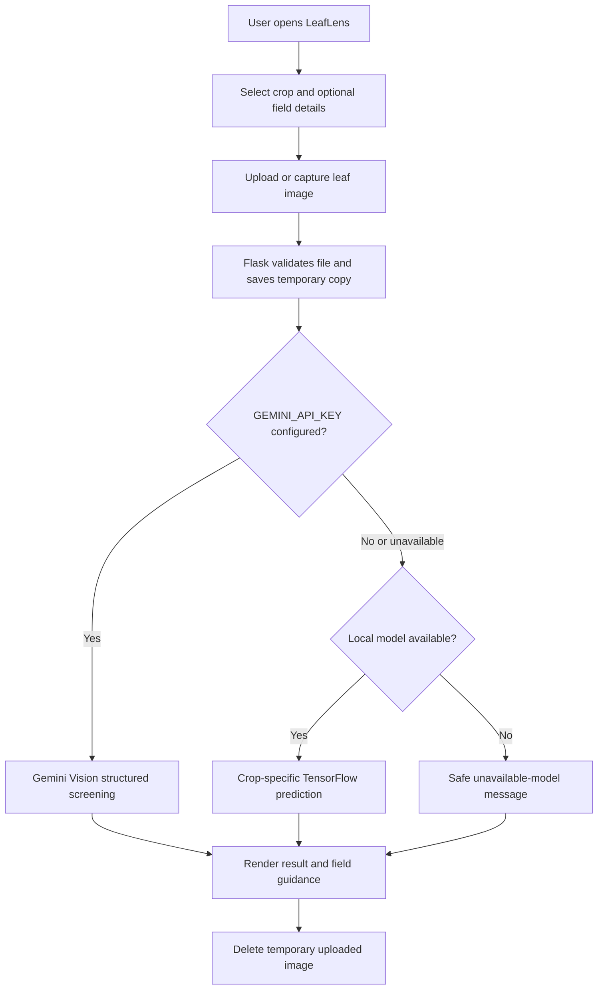

# LeafLens: Plant Disease Detection

LeafLens is a plant-health screening web application developed and maintained by **Ravi Mishra**. It allows a user to upload a leaf photograph, select the crop, and receive a cautious plant-health result through a Flask web interface.

The project combines a local crop-disease classification model with an optional Gemini Vision analysis workflow. It also includes crop planning, soil notes, weather lookup, camera capture, Hindi/English voice summaries, and treatment-safety guidance.

> This is an image-screening and educational tool, not a laboratory diagnosis. Confirm disease and treatment decisions with a qualified local agriculture expert.

## Live Application

- **Production:** [plant-disease-lens.vercel.app](https://plant-disease-lens.vercel.app)
- **Source code:** [github.com/RaviMishra3036/Detection-of-Plant-Disease-main](https://github.com/RaviMishra3036/Detection-of-Plant-Disease-main)

## Features

- Upload JPG, JPEG, PNG, or WEBP leaf images.
- Capture a plant image directly from a device camera.
- Select a crop and receive crop-specific screening where the local model has training coverage.
- Optional Gemini Vision analysis with structured observations and confidence.
- Hindi and English farmer-facing summaries with browser speech support.
- Crop planning from planting date, soil pH, and measured soil temperature.
- Live weather and soil estimates using the Open-Meteo geocoding and forecast APIs.
- Cautious medicine guidance using generic active ingredients only; no brand, dose, or false certainty is generated by the prompt.
- Temporary upload handling designed for Vercel's serverless filesystem.
- API keys are read from environment variables and are never committed to the repository.

## How It Works



### Analysis modes

1. **Gemini Vision mode:** If `GEMINI_API_KEY` is configured in the hosting environment, the image is sent to Gemini for cautious visual screening and a structured report.
2. **Local model mode:** When Gemini is unavailable and the model files are present, the TensorFlow model provides an offline crop-specific prediction.
3. **Safe fallback mode:** On Vercel, the large local model is excluded from the serverless bundle. If Gemini is unavailable there, the app displays a clear no-false-diagnosis message instead of pretending to identify a disease.

## Architecture

```text
Browser
  |
  v
Flask application (app.py)
  |-- templates/upload.html       UI, upload, camera, speech
  |-- crop planner                crop, soil, harvest calculations
  |-- weather client               Open-Meteo HTTP requests
  |-- Gemini client                optional environment-key API call
  |-- local predictor              optional TensorFlow + pickle model
  |
  +-- Local: uploads/ or configured UPLOAD_DIR
  +-- Vercel: /tmp temporary storage
```

The Vercel entrypoint is `api/index.py`, which exposes the Flask `app` object. `vercel.json` routes incoming requests to that entrypoint.

## Technology Stack

### Languages and application framework

- Python 3.12 on Vercel
- Python 3.11+ recommended for local TensorFlow usage
- Flask 3.1.3
- HTML5, CSS3, and browser JavaScript
- Jinja2 templates through Flask

### Python libraries

| Library | Purpose |
| --- | --- |
| Flask | Web server, routes, templates, and request handling |
| Werkzeug | Secure uploaded filenames and Flask utilities |
| NumPy | Image arrays and model input preparation |
| OpenCV | Image reading and resizing for local inference |
| TensorFlow / Keras | Local plant-disease model inference |
| Pickle | Loading the trained model and label transformer |

### External services

- **Google Gemini API:** optional visual analysis through `GEMINI_API_KEY`.
- **Open-Meteo Geocoding API:** converts a location into coordinates.
- **Open-Meteo Forecast API:** provides current weather and soil estimates.
- **Vercel:** production serverless hosting for the Flask application.
- **GitHub:** source-code hosting and Git LFS storage for the large model file.

## Project Structure

```text
Detection-of-Plant-Disease-main/
|-- api/index.py                              # Vercel Flask entrypoint
|-- app.py                                    # Main Flask application
|-- templates/upload.html                     # LeafLens user interface
|-- vercel.json                               # Vercel build and route settings
|-- requirements.txt                          # Lightweight Vercel dependencies
|-- requirements-local.txt                    # Local inference dependencies
|-- plant_disease_classification_model.pkl    # Local model, stored with Git LFS
|-- plant_disease_label_transform.pkl         # Model labels, stored with Git LFS
|-- PlantVillage/                             # Small local sample images
|-- train_quick.py                            # Training/support script
|-- PDD_Classification_Niranjan.ipynb         # Research/training notebook
|-- .env.example                              # Secret-free environment template
|-- .gitignore                                # Local secret/cache exclusions
|-- .vercelignore                              # Files excluded from Vercel bundle
`-- README.md
```

## Run Locally

### 1. Clone the project

```bash
git clone https://github.com/RaviMishra3036/Detection-of-Plant-Disease-main.git
cd Detection-of-Plant-Disease-main
```

### 2. Create and activate a virtual environment

Windows PowerShell:

```powershell
py -3.11 -m venv .venv
.\.venv\Scripts\Activate.ps1
```

macOS/Linux:

```bash
python3 -m venv .venv
source .venv/bin/activate
```

### 3. Install dependencies

For a lightweight web-only run:

```bash
python -m pip install -r requirements.txt
```

For local TensorFlow inference using the `.pkl` model:

```bash
python -m pip install -r requirements-local.txt
```

### 4. Configure optional Gemini access

Copy `.env.example` to `.env` and add the key locally:

```text
GEMINI_API_KEY=your_key_here
```

Never commit `.env`, paste the key into source code, or share it in an issue, screenshot, chat, or README.

### 5. Start the Flask app

```bash
python app.py
```

Open [http://127.0.0.1:5000](http://127.0.0.1:5000).

## Deploy to Vercel

The repository already contains the Vercel configuration:

- `api/index.py` exposes the Flask application.
- `vercel.json` maps all routes to the Python function.
- `.vercelignore` excludes the 189 MB local model and training files from the serverless upload.
- `requirements.txt` stays lightweight so the Vercel build remains within serverless limits.

From the project directory:

```bash
npm install --global vercel
vercel login
vercel --prod
```

### Add the Gemini key securely on Vercel

1. Open the Vercel project dashboard.
2. Go to **Settings -> Environment Variables**.
3. Create `GEMINI_API_KEY` and paste the value into the encrypted value field.
4. Select **Production**, and optionally **Preview** and **Development**.
5. Save the variable and redeploy the project.

The API key is not required for the page to load. Without it, Vercel uses the safe fallback when the local model is excluded.

## Model and Dataset Notes

The local classifier is loaded from `plant_disease_classification_model.pkl` and uses `plant_disease_label_transform.pkl` for class labels. The model was trained from PlantVillage-style leaf classes and currently has only partial crop coverage in the web application. The UI therefore checks whether a selected crop has trained labels before displaying a local prediction.

PlantVillage images are controlled dataset images. Results on real farm photographs can be less reliable because lighting, background, camera quality, cultivar, and multiple simultaneous problems may differ from the training data.

## Security and Privacy

- `.env` is ignored by Git.
- API keys are read with `os.getenv('GEMINI_API_KEY')` and are not hard-coded.
- Uploaded files use `secure_filename`, an extension allowlist, and a 10 MB request limit.
- Temporary uploaded images are deleted after processing.
- Vercel uploads use `/tmp`, not the read-only project filesystem.
- Do not upload private credentials, identity documents, or unrelated personal images.

## Limitations

- This tool cannot provide a laboratory-confirmed diagnosis.
- Gemini availability, quota, model access, and rate limits are controlled by Google.
- Weather data requires a usable location and an internet connection.
- The local model is excluded from Vercel because of serverless file-size limits.
- Treatment guidance should be verified with local agricultural authorities and product labels.

## Development

Run a basic syntax check before committing:

```bash
python -m py_compile app.py api/index.py
```

Keep generated caches, `.env`, uploaded images, and large model binaries out of normal Git commits. Model binaries are tracked with Git LFS:

```bash
git lfs install
git lfs track "*.pkl"
```

## Maintainer

**Ravi Mishra**

- GitHub: [RaviMishra3036](https://github.com/RaviMishra3036)
- Project: [Detection-of-Plant-Disease-main](https://github.com/RaviMishra3036/Detection-of-Plant-Disease-main)

## License

This project is released under the [MIT License](LICENSE).
